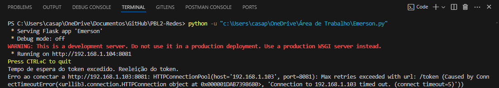

<!DOCTYPE html>
<html lang="pt-br">
<head>
    <meta charset="UTF-8">
    <meta name="viewport" content="width=device-width, initial-scale=1.0">
</head>
<body> 
  <h1>Transações Bancárias Distribuídas</h1>
    

Devido aos avanços dos bancos brasileiros nos atendimentos móveis, que visam facilitar a maneira com que os usuários realizam transações e operações no dia a dia, como checar saldo, extrato, limite de crédito, entre outros, houve um aumento substancial na adesão de seus clientes a essas plataformas. Além disso, outro fator culminante que influenciou esse desenvolvimento foi o surgimento da ferramenta Pix, cujo principal objetivo é garantir a rapidez dos pagamentos 24 horas por dia.

    

    
Mediante a isso, um país onde não existe um sistema bancário centralizado decidiu implementar a ferramenta Pix. No entanto, existem algumas diferenças na sua implementação devido ao seu sistema distinto. Para isso, é necessário utilizar uma abordagem que garanta a não concorrência nas operações entre os bancos e assegure a atomicidade das transações, evitando problemas como duplicação de dinheiro, perca de dinheiro, etc.

    <h2>Arquiterura do Projeto</h2>
    
Antes de explicar como é a arquitetura do projeto em si, vamos dar uma olhada e entender o que é um sistema que possui um Banco Central.

     
    

                <figure>
                    
                     
                    <figcaption>Arquitetura do Banco Central</figcaption>
                </figure>
            

     
    
Como mostra a imagem, o banco central é responsável por encaminhar todas as operações feitas entre os bancos e garantir a confiabilidade dessas operações, evitando gastos indevidos de dinheiro. Isso é possível porque todas as operações passam pelo banco central antes de serem concluídas. Caso haja conflito entre as transações, não haverá problema, pois existe uma ordem definida para cada uma.

    
Tendo mostrado um pouco de como funciona um sistema com o Banco Central, vamos ver como é a Arquitetura do sistema sem a presença de um Banco Central.

     
    

        <figure>
            
             
            <figcaption>Arquitetura do Projeto</figcaption>
        </figure>
    

     
    
No sistema mencionado, diferente do que tínhamos com o Banco Central, não há um ente responsável por receber todas as transações ou garantir sua confiabilidade. Em vez disso, cada banco segue uma regra pré-definida para evitar possíveis erros. Nesse caso, foi utilizada uma topologia de rede de computadores chamada Token Ring para garantir que somente um banco por vez possa efetuar uma transação, pois apenas um banco por vez terá acesso ao token, que é a entidade que permite a realização de uma transferência.

    
Segue um fluxo da execução do sistema:

    <ol>
        <li>Todos os bancos são inicializados, inclusive o escolhido para iniciar com o token.</li>
        <li>Qualquer cliente pode inserir uma transação a ser feita no seu banco.</li>
        <li>Caso exista alguma operação a ser feita pelo banco detentor do token, apenas uma é feita e o token é passado para o proximo da lista.</li>
        <li>Caso não exista nenhuma operação a ser feita pelo banco detentor do token, o token é passado para o proximo da lista.</li>
    </ol>
    <h2>Gerenciamento de Contas</h2>
    Para a criação de clientes foi utilizado a rota <strong>http://localhost:8081/clientes</strong> e a rota <strong>http://localhost:8081/clientes/{id_usuario}/contas</strong>, sendo a primeira responsável por criar um cliente e a segunda para definir uma conta principal do cliente para o banco, sendo que operações como consultar saldo, depositar e sacar dinheiro só seriam feitas para a conta principal naquele banco. Além disso, foi utilizada a rota <strong>http://localhost:8081/transferencias</strong> para mandar transações entre clientes de um mesmo banco ou entre bancos diferentes. Por fim, Vale ressaltar que tiverem outras rotas além dessas mencionadas, como a de fazer login <strong>http://localhost:8081/login</strong>, a de fazer deposito <strong>http://localhost:8081/clientes/{id}/contas/{id}/depositar</strong>, a de sacar <strong>http://localhost:8081/clientes/{id}/contas/{id}/sacar</strong>, e a de buscar cliente e contas que são utilizações das rotas citadas só que utilizando métodos diferentes:
    <h4>Sobre os métodos</h4>
        <ul>
            
-<strong>POST</strong>, método responsável por criar um item na rota expecíficada.

            
-<strong>GET</strong>, método responsável por pegar um item na rota expecíficada.

            
-<strong>PUT</strong>, método responsável por atualizar um item na rota expecíficada.

            
-<strong>DELETE</strong>, método responsável por deletar um item na rota expecíficada.

        </ul>
    
<strong>Obs.:</strong> Para testar se as rotas estavam funcionando foi utilizado o software Insomnia e Postman.

     
    
Os dados para gerenciamento dessas contas pelas rotas são enviados no formato parecido com a de um dicionário, as seguintes imagens são referentes ao formato enviado para fazer saques e depositos, outra para criar cliente, outra para adicionar uma conta e a última para fazer uma transação.

     
        

            <figure>
                
                 
                <figcaption>Exemplo de Saque/Deposito</figcaption>
            </figure>
        

     
        

            <figure>
                
                 
                <figcaption>Exemplo de Cliente</figcaption>
            </figure>
        

     
        

            <figure>
                
                 
                <figcaption>Exemplo de Conta</figcaption>
            </figure>
        

     
        

            <figure>
                
                 
                <figcaption>Exemplo de Transação</figcaption>
            </figure>
        

     
    
<strong>Obs.:</strong> Embora eu tenha uma rota para criar cliente e outra para criar usuário, ao me referir a um cliente específico, estou falando de um usuário que possui uma conta associada ao seu ID. Ou seja, cliente e conta se referem ao mesmo usuário. Além disso, uma transação pode ter varias operações diferente do que está sendo mostrado na imagem que só tem uma.

    <h2>Transferência entre diferentes contas</h2>
        
Como mencionado no tópico anterior é possível realizar transferências entre diferentes contas através da rota de transferências utilizando o formato demonstrado. Sendo que o campo "Usuário" refere-se ao ID do usuário que está realizando a transação, "id_destino" refere-se ao ID da conta de destino (destinatário da transferência), "id_origem" refere-se ao ID da conta do usuário naquele banco (ou de outro banco que ele também tenha conta), "valor" refere-se ao valor da transferência e o "status" refere-se ao status da transação que pode ser finalizada ou não.

        
Segue dois exemplos de transações de diferentes contas para uma mesma conta de destino, todas de um mesmo banco:

         
            

                <figure>
                    
                     
                    <figcaption>Conta 1 envia 100 R$ para a conta 3</figcaption>
                </figure>
            

         
         
            

                <figure>
                    
                     
                    <figcaption>Conta 2 envia 100 R$ para a conta 3</figcaption>
                </figure>
            

         
         
            

                <figure>
                    
                     
                    <figcaption>Utilizando o Postman para fazer duas transações simultâneas</figcaption>
                </figure>
            

             
    

        <table align="center">
            <tr>
                <td align="center">
                    <table>
                        <tr>
                            <td align="center">
                                
                            </td>
                        </tr>
                        <tr>
                            <td align="center">
                                <figcaption>Antes (Conta 1)</figcaption>
                            </td>
                        </tr>
                    </table>
                </td>
                <td align="center">
                    <table>
                        <tr>
                            <td align="center">
                                
                            </td>
                        </tr>
                        <tr>
                            <td align="center">
                                <figcaption>Depois (Conta 1)</figcaption>
                            </td>
                        </tr>
                    </table>
                </td>
            </tr>
        </table>
    

    

        <table align="center">
            <tr>
                <td align="center">
                    <table>
                        <tr>
                            <td align="center">
                                
                            </td>
                        </tr>
                        <tr>
                            <td align="center">
                                <figcaption>Antes (Conta 2)</figcaption>
                            </td>
                        </tr>
                    </table>
                </td>
                <td align="center">
                    <table>
                        <tr>
                            <td align="center">
                                
                            </td>
                        </tr>
                        <tr>
                            <td align="center">
                                <figcaption>Depois (Conta 2)</figcaption>
                            </td>
                        </tr>
                    </table>
                </td>
            </tr>
        </table>
    

    

        <table align="center">
            <tr>
                <td align="center">
                    <table>
                        <tr>
                            <td align="center">
                                
                            </td>
                        </tr>
                        <tr>
                            <td align="center">
                                <figcaption>Antes (Conta 3)</figcaption>
                            </td>
                        </tr>
                    </table>
                </td>
                <td align="center">
                    <table>
                        <tr>
                            <td align="center">
                                
                            </td>
                        </tr>
                        <tr>
                            <td align="center">
                                <figcaption>Depois (Conta 3)</figcaption>
                            </td>
                        </tr>
                    </table>
                </td>
            </tr>
        </table>
    

     
    
Percebe-se que as transferências acontecem com sucesso, pois existe saldo suficiênte para realizar as duas transações

     
            

                <figure>
                    
                     
                    <figcaption>Conta 1 envia 100 R$ para a conta 3</figcaption>
                </figure>
            

         
         
            

                <figure>
                    
                     
                    <figcaption>Conta 2 envia 150 R$ para a conta 3</figcaption>
                </figure>
            

         
         
            

                <figure>
                    
                     
                    <figcaption>Utilizando o Postman para fazer duas transações simultâneas</figcaption>
                </figure>
            

             
    

        <table align="center">
            <tr>
                <td align="center">
                    <table>
                        <tr>
                            <td align="center">
                                
                            </td>
                        </tr>
                        <tr>
                            <td align="center">
                                <figcaption>Antes (Conta 1)</figcaption>
                            </td>
                        </tr>
                    </table>
                </td>
                <td align="center">
                    <table>
                        <tr>
                            <td align="center">
                                
                            </td>
                        </tr>
                        <tr>
                            <td align="center">
                                <figcaption>Depois (Conta 1)</figcaption>
                            </td>
                        </tr>
                    </table>
                </td>
            </tr>
        </table>
    

    

        <table align="center">
            <tr>
                <td align="center">
                    <table>
                        <tr>
                            <td align="center">
                                
                            </td>
                        </tr>
                        <tr>
                            <td align="center">
                                <figcaption>Antes (Conta 2)</figcaption>
                            </td>
                        </tr>
                    </table>
                </td>
                <td align="center">
                    <table>
                        <tr>
                            <td align="center">
                                
                            </td>
                        </tr>
                        <tr>
                            <td align="center">
                                <figcaption>Depois (Conta 2)</figcaption>
                            </td>
                        </tr>
                    </table>
                </td>
            </tr>
        </table>
    

    

        <table align="center">
            <tr>
                <td align="center">
                    <table>
                        <tr>
                            <td align="center">
                                
                            </td>
                        </tr>
                        <tr>
                            <td align="center">
                                <figcaption>Antes (Conta 3)</figcaption>
                            </td>
                        </tr>
                    </table>
                </td>
                <td align="center">
                    <table>
                        <tr>
                            <td align="center">
                                
                            </td>
                        </tr>
                        <tr>
                            <td align="center">
                                <figcaption>Depois (Conta 3)</figcaption>
                            </td>
                        </tr>
                    </table>
                </td>
            </tr>
        </table>
    

     
    
Percebe-se que a primeira transferência acontece com sucesso, mas a segunda não, pois não existe saldo suficiênte para realizar as segunda transação

    
Segue dois exemplos de transações de diferentes contas para uma mesma conta de destino, sendo que existem dois bancos

     
            

                <figure>
                    
                     
                    <figcaption>Pacote que envia dinheiro da conta de diferentes bancos de um mesmo usuário</figcaption>
                </figure>
            

         
         
            

                <figure>
                    
                     
                    <figcaption>Utilização do Postman para testar a rota</figcaption>
                </figure>
            

         
    

        <table align="center">
            <tr>
                <td align="center">
                    <table>
                        <tr>
                            <td align="center">
                                
                            </td>
                        </tr>
                        <tr>
                            <td align="center">
                                <figcaption>Antes (Conta b1)</figcaption>
                            </td>
                        </tr>
                    </table>
                </td>
                <td align="center">
                    <table>
                        <tr>
                            <td align="center">
                                
                            </td>
                        </tr>
                        <tr>
                            <td align="center">
                                <figcaption>Depois (Conta b1)</figcaption>
                            </td>
                        </tr>
                    </table>
                </td>
            </tr>
        </table>
    

    

        <table align="center">
            <tr>
                <td align="center">
                    <table>
                        <tr>
                            <td align="center">
                                
                            </td>
                        </tr>
                        <tr>
                            <td align="center">
                                <figcaption>Antes (Conta b2)</figcaption>
                            </td>
                        </tr>
                    </table>
                </td>
                <td align="center">
                    <table>
                        <tr>
                            <td align="center">
                                
                            </td>
                        </tr>
                        <tr>
                            <td align="center">
                                <figcaption>Depois (Conta b2)</figcaption>
                            </td>
                        </tr>
                    </table>
                </td>
            </tr>
        </table>
    

    

        <table align="center">
            <tr>
                <td align="center">
                    <table>
                        <tr>
                            <td align="center">
                                
                            </td>
                        </tr>
                        <tr>
                            <td align="center">
                                <figcaption>Antes (Conta 3)</figcaption>
                            </td>
                        </tr>
                    </table>
                </td>
                <td align="center">
                    <table>
                        <tr>
                            <td align="center">
                                
                            </td>
                        </tr>
                        <tr>
                            <td align="center">
                                <figcaption>Depois (Conta 3)</figcaption>
                            </td>
                        </tr>
                    </table>
                </td>
            </tr>
        </table>
    

     
    
Percebe-se que o Pacote de transferências acontecem com sucesso, pois existe saldo suficiênte para realizar as duas transações

     
            

                <figure>
                    
                     
                    <figcaption>Pacote que envia dinheiro da conta de diferentes bancos de um mesmo usuário</figcaption>
                </figure>
            

         
         
            

                <figure>
                    
                     
                    <figcaption>Utilização do Postman para testar a rota</figcaption>
                </figure>
            

         
    

        <table align="center">
            <tr>
                <td align="center">
                    <table>
                        <tr>
                            <td align="center">
                                
                            </td>
                        </tr>
                        <tr>
                            <td align="center">
                                <figcaption>Antes (Conta b1)</figcaption>
                            </td>
                        </tr>
                    </table>
                </td>
                <td align="center">
                    <table>
                        <tr>
                            <td align="center">
                                
                            </td>
                        </tr>
                        <tr>
                            <td align="center">
                                <figcaption>Depois (Conta b1)</figcaption>
                            </td>
                        </tr>
                    </table>
                </td>
            </tr>
        </table>
    

    

        <table align="center">
            <tr>
                <td align="center">
                    <table>
                        <tr>
                            <td align="center">
                                
                            </td>
                        </tr>
                        <tr>
                            <td align="center">
                                <figcaption>Antes (Conta b2)</figcaption>
                            </td>
                        </tr>
                    </table>
                </td>
                <td align="center">
                    <table>
                        <tr>
                            <td align="center">
                                
                            </td>
                        </tr>
                        <tr>
                            <td align="center">
                                <figcaption>Depois (Conta b2)</figcaption>
                            </td>
                        </tr>
                    </table>
                </td>
            </tr>
        </table>
    

    

        <table align="center">
            <tr>
                <td align="center">
                    <table>
                        <tr>
                            <td align="center">
                                
                            </td>
                        </tr>
                        <tr>
                            <td align="center">
                                <figcaption>Antes (Conta 3)</figcaption>
                            </td>
                        </tr>
                    </table>
                </td>
                <td align="center">
                    <table>
                        <tr>
                            <td align="center">
                                
                            </td>
                        </tr>
                        <tr>
                            <td align="center">
                                <figcaption>Depois (Conta 3)</figcaption>
                            </td>
                        </tr>
                    </table>
                </td>
            </tr>
        </table>
    

     
    
Percebe-se que o Pacote de transferências  não acontece com sucesso, pois não existe saldo suficiênte para realizar as segunda transação

    <h2>Comunicação entre os Servidores</h2>
    
O protocolo de comunicação <strong>HTTP</strong> (HyperText Transfer Protocol) foi escolhido devido à sua ampla adoção e versatilidade na comunicação entre clientes e servidores na web. Ele é robusto e eficiente, permitindo a transferência de dados de maneira rápida e segura. A arquitetura cliente-servidor do <strong>HTTP</strong> facilita a implementação de sistemas distribuídos e escaláveis.

    
Além disso, o <strong>HTTP</strong> é compatível com diversos tipos de dados, como texto, imagens, vídeos e outros formatos de mídia, tornando-o ideal para aplicações web que precisam transmitir diferentes tipos de conteúdo. O suporte a uma variedade de métodos de requisição, como <strong>GET</strong>, <strong>POST</strong>, <strong>PUT</strong> e <strong>DELETE</strong>, é essencial para operações <strong>CRUD</strong> (Create, Read, Update, Delete) em sistemas de gerenciamento de dados.

    <h2>Sincronização em um único servidor</h2>
    Para evitar conflitos de dados em um servidor único, como quando dois usuários de um banco tentam realizar transações simultâneas, utilizamos o método <strong>'lock'</strong> do Python. Esse recurso garante que apenas um usuário por vez tenha acesso a um recurso específico, garantindo a integridade dos dados e prevenindo inconsistências durante as operações.
    <h2>Sincronização para mais de um servidor</h2>
    Para evitar conflitos de dados entre servidores, adotamos a topologia de rede em anel, onde um token é passado de um nó para outro no sistema bancário. Essa abordagem garante que apenas o banco detentor do token possa realizar transferências, proporcionando controle sobre as operações. No entanto, a implementação dessa topologia pode apresentar desafios, como a possível perda do token, o que pode resultar em ociosidade no sistema.

Para mitigar esse problema, estabelecemos que se um banco não receber o token por um período prolongado, ele iniciará um processo para gerar um novo token na rede. Isso visa evitar longos períodos de espera desnecessária entre os bancos na rede, mantendo a eficiência das operações. Além disso, para lidar com a situação em que uma máquina que perdeu o token retorna à rede, implementamos um número de sequência para cada token. Dessa forma, apenas o token com o número de sequência maior será reconhecido pela rede, prevenindo a ocorrência de concorrência com dois tokens simultâneos.
 
    

        <figure>
            
             
            <figcaption>Exemplo do token sendo passado entre duas maquinas, sendo que a imagem representa a segunda maquina a receber o token</figcaption>
        </figure>
    

 
 
    

        <figure>
            
             
            <figcaption>Exemplo do token sendo gerado quando o tempo definido de espera ter terminado</figcaption>
        </figure>
    

 
 
    

        <figure>
            
             
            <figcaption>Exemplo de quando um token com sequência inválida chega em uma máquina</figcaption>
        </figure>
    

 
<h2>Confiabilidade do sistema</h2>
    Quando um dos bancos da rede sai do ar, os outros bancos não são afetados devido ao algoritmo implementado no Token Ring. Este algoritmo sempre tenta passar o token para o próximo banco conectado na rede. Se o próximo banco estiver desconectado, o token é passado para o banco subsequente e assim por diante. Além disso, se um banco que saiu do ar se reconectar, ele eventualmente voltará a receber o token.
    
Dessa forma, pode-se assegurar que o sistema é confiável.
    <h2>Transações concorrentes</h2>
    
No caso de transações concorrentes, não há problema porque tanto o mecanismo de lock quanto o Token Ring garantem que nem clientes do mesmo banco, nem clientes de bancos diferentes, realizarão transações exatamente ao mesmo tempo. Isso significa que as transações só ocorrerão se houver saldo suficiente e no momento correto, evitando assim a duplicação de dinheiro em qualquer uma das contas.

    <h2>Transações atômicas</h2>
    
O protocolo <strong>2PC</strong> foi utilizado para assegurar a consistência das transações entre múltiplos bancos. Ele opera garantindo que uma transação só seja executada quando todos os bancos concordarem e estiverem prontos para realizar a transferência. Esse processo inclui uma fase de preparação, onde os dados são verificados, seguida pela fase final onde a transação é efetivamente realizada. É importante destacar que qualquer erro em qualquer uma das fases resultará no coordenador instruindo todos os bancos a desfazerem as operações realizadas, evitando assim inconsistências nos dados.

    <h2>Interface</h2>
    
Segue as imagens principais da interface CLI:

     
    

        <figure>
            
             
            <figcaption>Tela onde o usuário decide se quer fazer login ou cadastro</figcaption>
        </figure>
    

     
     
        

            <figure>
                
                 
                <figcaption>Exemplo de quando ele decide fazer cadastro</figcaption>
            </figure>
        

     
     
        

            <figure>
                
                 
                <figcaption>Exemplo de quando ele decide fazer login</figcaption>
            </figure>
        

     
     
        

            <figure>
                
                 
                <figcaption>Exemplo de quando ele está logado</figcaption>
            </figure>
        

     
    
<strong>Obs.:</strong> Quando ele está logado na conta ele pode fazer operações como consultar saldo, realizar depositos na conta daquele banco, realizar saques na conta daquele banco, realizar transferências de todas as suas contas cadastradas, cadastrar contas de outros bancos que ele tem acesso e visuaizar as contas que ele cadastrou. Para isso, será pedido informações assim como demonstrado na parte de gerenciamento de contas antes de realizar de fato as operações.

    <h2>Conclusão</h2>
    
Enfim, conclui-se que o projeto entregue abrange todos os requisitos solicitados no problema, abordando o uso de threads, gerenciamento de contas utilizando o protocolo <strong>HTTP</strong>, atomicidade das transações utilizando o protocolo <strong>2PC</strong> e tratamentos para problemas de concorrência utilizando a topologia de rede Token Ring para criação de um pix para sistemas bancários distribuidos.

    
Ademais, vale mencionar possíveis alterações para uma melhor usabilidade da interface do cliente como o uso de React para o front-end.

  <h2>Como Executar o Projeto</h2> 
    
Siga os seguintes passos para a execução do projeto:

    <ul>
      <li>baixe o repositório: 
          <a href="https://github.com/emersonrlp/PBL2-Redes">https://github.com/emersonrlp/PBL2-Redes.git</a>
      </li>
      <li>adicione o ip de todas as maquinas que serão conectadas na lista de ips no arquivo api.py'</strong></li>
      <li>execute o seguinte comando com o terminal nas pastas Cliente e Banco: <strong>'docker build -t nome_do_arquivo .'</strong></li>
      <li>digite <strong>'docker images'</strong> para ver se as imagens docker foram criadas com sucesso.</li>
      <li>por fim, execute o programa usando o comando <strong>'docker run --network='host' -it -e IP_ADDRESS=ip_do_banco nome_da_imagem'</strong> para executar as imagens dos bancos e dos clientes.</li>
   </ul>
  
tendo feito isso, é possível criar contas, consultar saldo, realizar depositos, saques, transferências de todas as contas finculadas a um cliente expecífico.
    
    
<strong>Obs.:</strong> é necessário ter o docker instalado na máquina que deseja executar o código.

</body>
</html>
